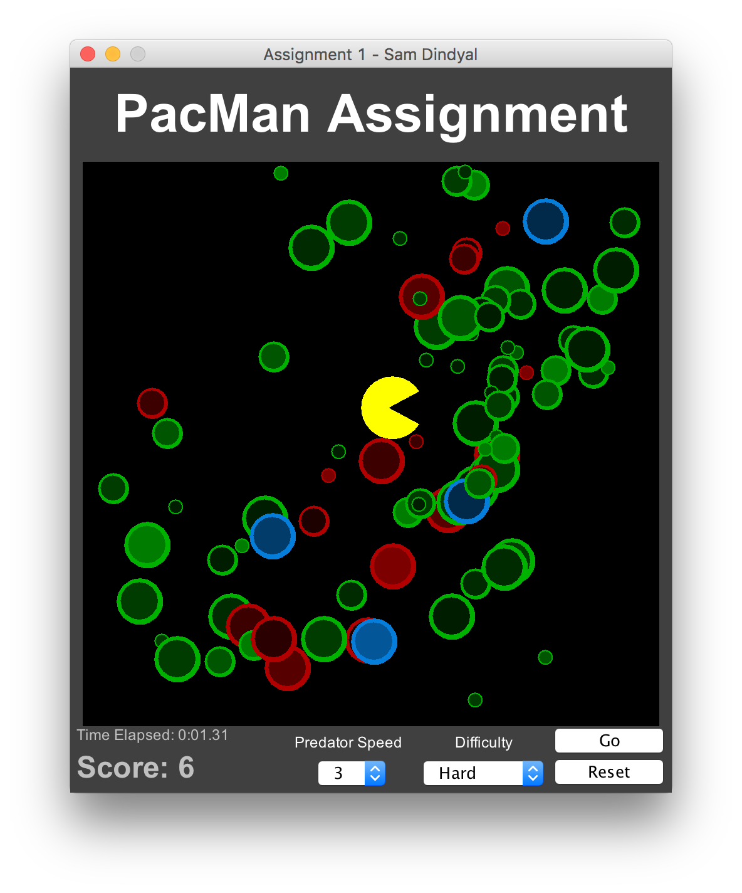

# PacMan Assignment



For the first assignment of CPS209, I designed a game in Java, using Swing and paint methods, to create a game which resembles Pacman. The purpose of this assigment was to demonstrate polymorphism using the "Creature", "Predator" and "Prey" classes.

This application can be compiled using the Makefile provided.

```bash
make clean      # Cleans up previously compiled classes
make build      # Builds executable jar in project root
```

After building, the application can be run using the executable jar created in the project's root directory: <code>A1.jar</code>.
